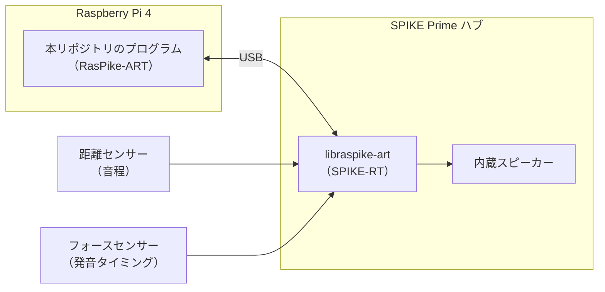

# electric-guitar

[RasPike-ART](https://github.com/ETrobocon/RasPike-ART) を使って、LEGO® SPIKE™ Prime で組み立てた「エレキギター」を演奏するためのプログラムを開発するリポジトリです。

## 概要

SPIKE Prime の部品で組み立てたギター型の楽器を、Raspberry Pi 上で動くプログラムから制御します。

- **左手（音程）**: 距離センサー（超音波センサー）で、弦を押さえるパーツとセンサーの距離を測定し、その距離に応じて音程を決めます。
- **右手（発音）**: フォースセンサー（圧力センサー）を押して、音を出すタイミングと長さ（間）を調整します。
- **音の出力**: SPIKE ハブの内蔵スピーカーから音を鳴らします。

## システム構成



RasPike-ART は、Raspberry Pi 側の EV3RT 互換環境（TOPPERS/ASP3 ベース）と、SPIKE 側の受信ソフトウェア [libraspike-art](https://github.com/ETrobocon/libraspike-art)（SPIKE-RT 製）で構成されています。Raspberry Pi 側のプログラムから SPIKE-RT と同じ API でセンサーやハブのスピーカーを利用できます。

### 使用機材

| 機材 | 用途 |
| --- | --- |
| Raspberry Pi 4（Raspberry Pi OS 64bit） | プログラムの実行環境 |
| LEGO SPIKE Prime ハブ | センサー接続、音の出力（内蔵スピーカー） |
| LEGO SPIKE 距離センサー | 弦を押さえるパーツまでの距離の測定（音程） |
| LEGO SPIKE フォースセンサー | 発音のタイミング・長さの入力 |
| USB ケーブル | Raspberry Pi と SPIKE の接続（**充電専用ケーブルは不可**） |

### ポート割り当て

| ポート | デバイス |
| --- | --- |
| A（仮） | 距離センサー |
| B（仮） | フォースセンサー |

※ 組み立て後に確定します。変更する場合は `app.c` のポート定義を書き換えてください。

## 開発環境のセットアップ

本リポジトリは、RasPike-ART のサンプル `sample_c5_spike` と同じく、`sdk/workspace` 配下に置く 1 つのアプリケーションです。そのため、RasPike-ART を取得したあと、`sdk/workspace` に移動してから本リポジトリを clone します。

```
RasPike-ART/
└── sdk/
    └── workspace/
        ├── Makefile
        ├── sample_c5/
        ├── sample_c5_spike/
        └── electric-guitar/   ← 本リポジトリ
```

RasPike-ART の詳細は [RasPike-ART の README](https://github.com/ETrobocon/RasPike-ART) を参照してください。

1. Raspberry Pi 上で RasPike-ART を取得します（`--recursive` を忘れずに）。

   ```bash
   git clone --recursive https://github.com/ETrobocon/RasPike-ART.git
   ```

2. `sdk/workspace` に移動し、本リポジトリを clone します。

   ```bash
   cd RasPike-ART/sdk/workspace
   git clone https://github.com/taro0826/electric-guitar.git
   ```

3. SPIKE への書き込み環境をセットアップします（初回のみ）。`sdk/workspace` で実行します。

   ```bash
   make -f ../common/Makefile.raspike-art setup_spike_env
   ```

4. SPIKE を DFU モードにして、SPIKE 側のプログラムを書き込みます。

   ```bash
   make -f ../common/Makefile.raspike-art update_spike
   ```

## ビルドと実行

> 本リポジトリのプログラムは現在開発中です（雛形のみ）。

### ファイル構成

`sample_c5_spike` と同様の構成です。

| ファイル | 内容 |
| --- | --- |
| `app.c` | メインタスク。センサーのポート定義と、ギタータスクの起動 |
| `app.h` | タスク優先度・タスク周期（`GUITAR_PERIOD`）の定義 |
| `app.cfg` | タスクと周期ハンドラの生成（通常は変更不要） |
| `Makefile.inc` | ビルド設定 |
| `Guitar/Guitar.c` | ギタータスク本体。センサー値の取得と発音の処理を実装する |
| `Guitar/Guitar.h` | ギターの調整用パラメータの定義 |

演奏の処理は `Guitar/Guitar.c` の `guitar_task()`（10msec 周期で呼び出される）に実装します。タスク周期を変更する場合は `app.h` の `GUITAR_PERIOD` を変更してください。

`sdk/workspace` で次のようにビルド・実行します。

```bash
make img=electric-guitar
make start
```

実行手順:

1. SPIKE のセンターボタンを押して電源を入れ、「∞」マークが表示された状態にします。
2. Raspberry Pi 側の `sdk/workspace` で `make start` を実行します。
3. 停止するときは `Ctrl+C` を押し、SPIKE のセンターボタンを長押しして電源を切ります。

## ロードマップ

- [ ] ギター本体の組み立て
- [ ] ポート割り当ての確定
- [ ] 距離センサーの値と音程の対応づけ（キャリブレーション）
- [ ] フォースセンサーによる発音制御
- [ ] 内蔵スピーカーでの演奏

## 謝辞・参考

- [ETrobocon/RasPike-ART](https://github.com/ETrobocon/RasPike-ART) — Raspberry Pi 用 SPIKE 制御開発環境
- [ETrobocon/libraspike-art](https://github.com/ETrobocon/libraspike-art) — SPIKE 側の受信ソフトウェア
- [20+ Amazing LEGO SPIKE Robots You Can Actually Build（Prof. Bricks）](https://youtu.be/C_P3nNl0XQo?t=530) — SPIKE で作れるギターの紹介
- [SPIKEGuitar building instructions（Coder Shah）](https://www.youtube.com/watch?v=HkK7VRdXLWE) — SPIKE Prime 基本セット（45678）で作るギターの組み立て手順。Daniele Benedettelli 氏設計の LEGO MINDSTORMS EV3 ギターがベースになっています。

LEGO、SPIKE、MINDSTORMS は LEGO Group の商標です。本リポジトリは LEGO Group とは関係ありません。
